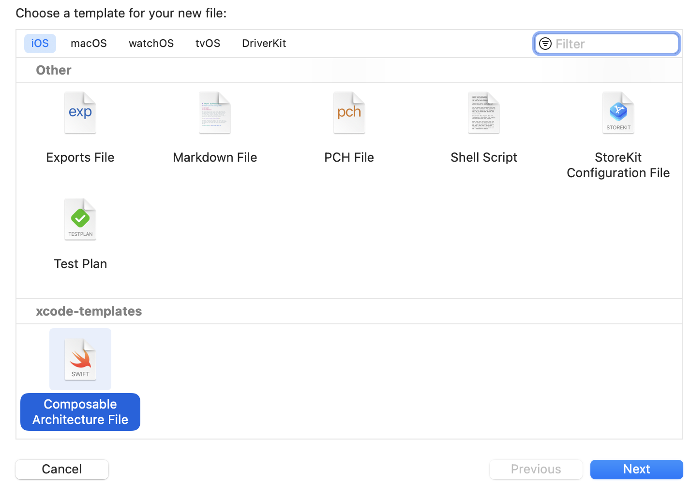

# Xcode Templates

Xcode’s allow you to pre-fill the contents of new files and project so that you can get to work more quickly by adding custom templates into your `~/Library/Developer/Xcode/Templates` folder.

You only need to clone this repository as follows:

```
cd ~/Library/Developer/Xcode/Templates && git clone https://github.com/salavert/xcode-templates.git
```

## Templates

### Composable Architecture template
This template creates a file with a base ReducerProtocol implementation (State and Actions) and a SwiftUI view with ViewStore and Preview.

Tested with v0.42.0 of [Composable Architecture](https://github.com/pointfreeco/swift-composable-architecture) from Point-Free.

## Usage
File ▸ New (⌘ + N)
